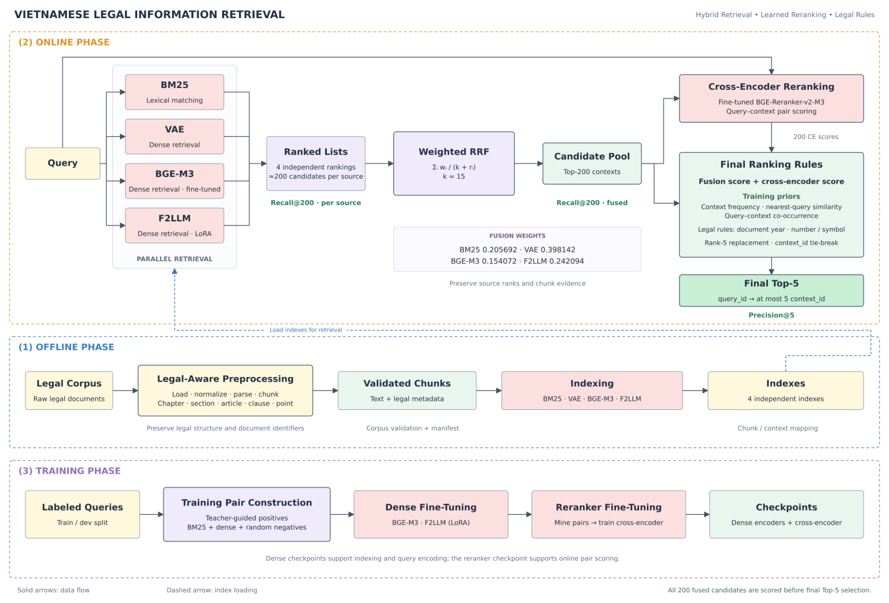

# Vietnamese Legal Information Retrieval

### 2nd Place — UIT Data Science Challenge 2026 · Task 1: LegalIR · Private Phase

**Team: [UIT-Trust&Companion](https://www.codabench.org/profiles/organization/4003/)**  
**Recall: 0.9551 · Precision: 0.2051**

Our solution combines **four complementary retrieval sources**, **weighted reciprocal rank fusion**, a **fine-tuned cross-encoder**, and **legal-aware ranking rules** to retrieve relevant Vietnamese legal documents. Given a question, the system returns up to five document identifiers from the competition corpus.

[Competition & Leaderboard](https://www.codabench.org/competitions/17715/#/results-tab) · [Architecture](#system-architecture) · [Method](#method) · [Training](#training) · [Usage](#usage) · [Evaluation](#evaluation)

## Competition Results

Our team achieved **2nd place on the UIT-DSC 2026 Subtask 1 Private Phase leaderboard**, with a macro Recall of **95.51%**.

| Rank | Team | Recall ↑ | Precision ↑ |
| ---: | --- | ---: | ---: |
| 1 | [UIT-nobody](https://www.codabench.org/profiles/organization/4065/) | 0.9588 | 0.2061 |
| **2** | **[UIT-Trust&Companion](https://www.codabench.org/profiles/organization/4003/)** | **0.9551** | **0.2051** |
| 3 | [TurtleMind](https://www.codabench.org/profiles/organization/4026/) | 0.9540 | 0.2048 |
| 4 | [ctin2](https://www.codabench.org/profiles/user/ctin2/) | 0.9538 | 0.2050 |
| 5 | [UIT-YQueFue36](https://www.codabench.org/profiles/organization/3973/) | 0.9528 | 0.2052 |

*Private-phase results; our submission ID: `941589`. Recall is the primary ranking metric, with Precision used to break ties.*

## Overview

Vietnamese legal retrieval requires matching natural-language questions to documents with precise terminology, hierarchical provisions, and references to document numbers and years. A relevant document may use wording different from the question, while a document with similar wording may refer to a different regulation or legal context.

We address these challenges through a multi-stage retrieval system:

1. **Preserve legal structure** during preprocessing and maintain stable links between chunks and their source documents.
2. **Retrieve broadly** with BM25 and three dense encoders: Vietnamese Embedding v2, fine-tuned BGE-M3, and LoRA-adapted F2LLM.
3. **Fuse rankings** using weighted RRF to form a shared pool of 200 candidate contexts.
4. **Score query–context relevance** with a fine-tuned BGE-Reranker-v2-M3 cross-encoder.
5. **Select the final five contexts** using retrieval scores, cross-encoder signals, training-derived priors, and legal metadata.

The system targets **Task 1 — LegalIR**, which retrieves document IDs from approximately **8,500 administrative documents** supplied by the organizers. The competition also includes an independent LegalQA task; the pipeline documented here produces retrieval results rather than generated answers.

## System Architecture



**Figure 1.** The offline phase prepares the corpus and builds four independent indexes. At query time, four ranked lists are fused into a Top-200 pool, scored by the cross-encoder, and processed by the final ranking rules. The training phase supplies the dense and reranker checkpoints.

> **Candidate preservation:** the cross-encoder scores the full fused Top-200 pool. Final rules operate before Top-5 selection, so candidates remain available for the final decision.

## Method

### 1. Legal-Aware Corpus Preparation

Raw legal documents are normalized and parsed before indexing. Preprocessing includes Unicode and whitespace normalization, recognition of legal structure, chunk construction, metadata assignment, and corpus validation.

The parser identifies document titles and identifiers, chapters, sections, articles, clauses, and points. Each retrieval chunk retains the information needed to trace it back to the original document:

| Field | Purpose |
| --- | --- |
| `context_id` | Identifier of the source context/document |
| `chunk_id` | Identifier of an individual retrieval chunk |
| `text` | Text used for encoding and retrieval |
| `view`, `row_id` | Representation and row identifiers |
| Document number / year | Metadata used by the legal ranking rules |

The output is a validated `retrieval_chunks.jsonl` corpus, query JSONL files, a corpus manifest, and a quality report. Chunk/context mappings remain consistent across indexing, retrieval, fusion, and reranking.

**Identifier convention:** the implementation uses `context_id` for the source-document identifier. Competition evaluation refers to `document_id`. Submitted IDs must match the organizer-provided document identifiers; `chunk_id` is an internal retrieval identifier and is not submitted as a document ID.

### 2. Four-Source Hybrid Retrieval

Each query is processed independently by four retrieval sources, targeting approximately **200 candidates per source**.

| Source | Model / implementation | Role in the ensemble |
| --- | --- | --- |
| **BM25** | Sparse inverted index with Vietnamese legal tokenization | Lexical matching, including legal terminology and explicit document references |
| **VAE** | `AITeamVN/Vietnamese_Embedding_v2` | Vietnamese semantic retrieval |
| **BGE-M3** | Fine-tuned `BAAI/bge-m3` | Dense retrieval adapted to the task's query–context relationships |
| **F2LLM** | `codefuse-ai/F2LLM-1.7B` with LoRA adaptation | An additional dense retrieval representation |

*VAE is the retrieval-source label used in this project for Vietnamese Embedding v2.*

BM25 supplies lexical evidence, while the dense encoders provide semantic matches across different formulations of the same information need. The design combines these sources at the ranking level rather than assuming their raw scores are directly comparable.

Each index stores its chunk/context mapping and relevant configuration. Dense index artifacts additionally record the encoder, embedding dimension, maximum length, model manifest, and file inventory. Each retrieval output retains source ranks, raw scores, context IDs, and chunk evidence for downstream processing.

### 3. Weighted Reciprocal Rank Fusion

The four ranked lists are merged using **weighted Reciprocal Rank Fusion (RRF)**:

```math
S_{\mathrm{RRF}}(d,q)
=
\sum_{i \in \mathcal{R}(d,q)}
\frac{w_i}{k + r_i(d,q)}
```

Here, $q$ is the query, $d$ is a candidate context, $r_i(d,q)$ is its one-based rank in source $i$, and $w_i$ is the source weight. The set $\mathcal{R}(d,q)$ contains the sources that retrieved $d$; a source contributes zero when the candidate is absent from its list.

The documented system configuration is:

| Source | Weight |
| --- | ---: |
| BM25 | 0.205692 |
| VAE | 0.398142 |
| BGE-M3 | 0.154072 |
| F2LLM | 0.242094 |

- **Smoothing constant:** `k = 15`.
- **Candidate pool:** Top-200 contexts per query after fusion.
- **Retained evidence:** fusion score, individual source ranks, chunk evidence, and legal metadata.

RRF combines agreement across ranked lists while avoiding direct addition of BM25 scores and dense similarity scores. Source weights control each retriever's contribution to the shared candidate pool.

### 4. Cross-Encoder Reranking

A fine-tuned **`BAAI/bge-reranker-v2-m3`** scores query–candidate pairs from the fused pool. Joint encoding of the question and candidate text provides a relevance signal beyond the independent embeddings used for dense retrieval.

The reranking stage exports context-level logits with `query_id` and `context_id` to:

```text
outputs/rerank/signals/ce_context_max.jsonl
```

These logits are passed to final ranking alongside the original fusion evidence. **There is no intermediate Top-10 truncation:** all 200 fused candidates remain available until the final selection rules are applied.

### 5. Final Ranking with Training Priors and Legal Rules

The final stage combines neural and retrieval signals with information specific to the training distribution and legal corpus.

| Signal group | Included signals | Intended role |
| --- | --- | --- |
| **Retrieval and neural relevance** | Fusion score; cross-encoder context logit | Combine multi-source retrieval evidence with joint query–context relevance |
| **Training-derived priors** | Context frequency in training labels; nearest training-query similarity; query/context co-occurrence | Incorporate patterns observed in labeled training queries |
| **Legal metadata** | Document year; document number or symbol | Refine ranking when the query refers to a particular legal document |
| **Final selection** | Rank-5 candidate replacement; deterministic `context_id` tie-break | Apply the final candidate-selection rules and resolve ties consistently |

These signals form a rule-based final ranking stage; the pipeline description does not imply a single linear blend with unspecified coefficients. Rule settings and fusion parameters should be fixed on held-out development data before final evaluation.

The output contains **at most five unique context IDs per query**, together with the full candidate ranking and a processing report for inspection.

## Training

Training is performed separately from online inference. The workflow adapts the dense encoders first, then constructs training pairs for the cross-encoder.

| Stage | Procedure | Output |
| --- | --- | --- |
| **Train/dev split** | Separate labeled queries for training and development | Saved development query IDs |
| **Positive selection** | Use a teacher cross-encoder to guide positive selection | Positive query–context pairs |
| **Negative mining** | Gather BM25 and dense hard negatives, together with random negatives | Negative pairs and training triplets |
| **Dense adaptation** | Fine-tune BGE-M3 and adapt F2LLM with LoRA | Dense encoder checkpoints |
| **Reranker data construction** | Mine query–candidate pairs using the adapted retrieval setup | Cross-encoder training pairs |
| **Cross-encoder adaptation** | Fine-tune BGE-Reranker-v2-M3 | Reranker checkpoint |
| **Artifact tracking** | Record manifests, file inventories, and checksums | Reproducible model artifacts |

Hard negatives expose the models to candidates that are plausible retrieval matches but are not relevant to the query. The intended benefit is finer discrimination between closely related legal passages.

For held-out development evaluation, derive training priors from the training partition only and exclude held-out labels from pair construction and negative mining. Keep the saved split, selected checkpoints, and ranking configuration consistent across experiments.

Training entry points include:

```bash
python -m legal_ir.training.build_dense_training_data --help
python -m legal_ir.training.mine_dense_negatives --help
python -m legal_ir.training.train_bge_embedder --help
python -m legal_ir.training.run_f2llm_epoch --help
python -m legal_ir.training.mine_reranker_pairs --help
python -m legal_ir.training.train_cross_encoder --help
```

## Project Structure

The package is organized around corpus preparation, retrieval, training, and artifact utilities.

| Path | Responsibility |
| --- | --- |
| `src/legal_ir/core/commons.py` | Shared I/O, normalization, tokenization, hashing, manifests, and submission validation |
| `src/legal_ir/preprocessing/preprocess.py` | Corpus parsing, chunking, and workspace validation |
| `src/legal_ir/retrieval/index_bm25.py` | Sparse index construction |
| `src/legal_ir/retrieval/index_dense.py` | Dense index construction |
| `src/legal_ir/retrieval/retrieve_bm25.py` | BM25 query retrieval |
| `src/legal_ir/retrieval/retrieve_dense.py` | Dense query retrieval |
| `src/legal_ir/retrieval/fuse.py` | Weighted RRF fusion |
| `src/legal_ir/retrieval/rerank.py` | Cross-encoder scoring |
| `src/legal_ir/retrieval/apply_ranking_rules.py` | Final ranking and submission generation |
| `src/legal_ir/training/` | Pair construction, negative mining, dense training, and cross-encoder training |
| `src/legal_ir/tools/make_checkpoints_sha256sums.py` | Checkpoint checksum generation |
| `assets/architecture.png` | System architecture figure |

Modules are invoked through `python -m legal_ir...` from the installed package.

## Usage

### Environment and Artifacts

The documented environment uses **Python 3.12**. Install the main dependencies and package from the repository root:

```bash
python -m pip install -r requirements.txt
python -m pip install -e .
```

F2LLM uses the separate environment specification in `requirements-f2llm.txt`. Dense encoding and cross-encoder scoring require the corresponding model environment and GPU resources described by the project setup.

Before running inference, prepare the competition corpus, query files, fine-tuned checkpoints, and reranker manifest. The commands below follow the documented package interface; checkpoint paths and manifests must point to your local artifacts.

Examples use **Bash**. Set the working paths once:

```bash
export LEGALIR_WORKSPACE="workspaces/legal_ir"
export LEGALIR_RUN="runs/legal_ir"
export LEGALIR_BGE_CHECKPOINT="/path/to/bge-m3-checkpoint"
export LEGALIR_F2LLM_CHECKPOINT="/path/to/f2llm-checkpoint"
```

### Step 1 — Prepare and Validate the Corpus

```bash
python -m legal_ir.preprocessing.preprocess build \
  --contexts-dir contexts/corpus \
  --queries train.json queries.json \
  --labeled-queries train.json \
  --output "$LEGALIR_WORKSPACE"

python -m legal_ir.preprocessing.preprocess validate \
  --workspace "$LEGALIR_WORKSPACE"
```

Expected artifacts include `corpus/retrieval_chunks.jsonl`, `queries/train.jsonl`, `queries/queries.jsonl`, manifests, and quality reports.

### Step 2 — Build the Four Indexes

```bash
python -m legal_ir.retrieval.index_bm25 \
  --corpus "$LEGALIR_WORKSPACE/corpus/retrieval_chunks.jsonl" \
  --index-dir "$LEGALIR_RUN/indexes/bm25"

python -m legal_ir.retrieval.index_dense --encoder vae-v2 \
  --corpus "$LEGALIR_WORKSPACE/corpus/retrieval_chunks.jsonl" \
  --index-dir "$LEGALIR_RUN/indexes/vae"

python -m legal_ir.retrieval.index_dense --encoder bge-m3 \
  --model-name "$LEGALIR_BGE_CHECKPOINT" \
  --corpus "$LEGALIR_WORKSPACE/corpus/retrieval_chunks.jsonl" \
  --index-dir "$LEGALIR_RUN/indexes/bgem3"

python -m legal_ir.retrieval.index_dense --encoder f2llm-1.7b \
  --model-name "$LEGALIR_F2LLM_CHECKPOINT" \
  --corpus "$LEGALIR_WORKSPACE/corpus/retrieval_chunks.jsonl" \
  --index-dir "$LEGALIR_RUN/indexes/f2llm"
```

Use the same encoder checkpoint and compatible encoding settings for indexing and query retrieval.

### Step 3 — Retrieve Candidates

```bash
python -m legal_ir.retrieval.retrieve_bm25 \
  --index-dir "$LEGALIR_RUN/indexes/bm25" \
  --queries "$LEGALIR_WORKSPACE/queries/queries.jsonl" \
  --output-dir "$LEGALIR_RUN/outputs/bm25"

for source in vae bgem3 f2llm; do
  python -m legal_ir.retrieval.retrieve_dense \
    --index-dir "$LEGALIR_RUN/indexes/$source" \
    --queries "$LEGALIR_WORKSPACE/queries/queries.jsonl" \
    --output-dir "$LEGALIR_RUN/outputs/$source"
done
```

Each source produces its own `ranked.jsonl`. Configure candidate depth to match the approximately 200-candidate setting described above.

### Step 4 — Fuse Rankings

```bash
python -m legal_ir.retrieval.fuse \
  --source "bm25=$LEGALIR_RUN/outputs/bm25/ranked.jsonl" \
  --source "vae=$LEGALIR_RUN/outputs/vae/ranked.jsonl" \
  --source "bgem3=$LEGALIR_RUN/outputs/bgem3/ranked.jsonl" \
  --source "f2llm=$LEGALIR_RUN/outputs/f2llm/ranked.jsonl" \
  --output-dir "$LEGALIR_RUN/outputs/fused"
```

Ensure the fusion configuration uses the weights in the method section, `rrf_k = 15`, and a 200-context pool. The command above specifies input/output paths; it does not explicitly override those configuration values.

### Step 5 — Score with the Cross-Encoder

```bash
export PROJECT_ROOT="$PWD"
export RETRIEVAL_DIR="$LEGALIR_RUN"
export QUERY_WORKSPACE="$LEGALIR_WORKSPACE"
export QUERIES="$LEGALIR_WORKSPACE/queries/queries.jsonl"
export CHAMPION_MANIFEST="/path/to/reranker-manifest.json"
export RERANK_WORKFLOW="private"
export OUTPUT_DIR="$LEGALIR_RUN/outputs/rerank"

python -m legal_ir.retrieval.rerank
```

The manifest must identify the intended fine-tuned reranker and its associated artifacts. The resulting `signals/ce_context_max.jsonl` supplies context-level logits to final ranking.

### Step 6 — Apply Final Rules and Export the Submission

```bash
python -m legal_ir.retrieval.apply_ranking_rules apply-ranking-rules \
  --fused "$LEGALIR_RUN/outputs/fused/ranked.jsonl" \
  --ce-logits "$LEGALIR_RUN/outputs/rerank/signals/ce_context_max.jsonl" \
  --questions queries.json \
  --train-json train.json \
  --corpus "$LEGALIR_WORKSPACE/corpus/retrieval_chunks.jsonl" \
  --out-dir "$LEGALIR_RUN/final"
```

| Artifact | Content |
| --- | --- |
| `top200.jsonl` | Candidate rankings for inspection |
| `submission.json` | Final query-to-context-ID predictions |
| `submission.zip` | Packaged submission |
| `report.json` | Processing and validation report |

An illustrative `submission.json` entry is:

```json
{
  "query_001": ["context_012", "context_045", "context_078", "context_103", "context_214"]
}
```

Use actual query and context IDs from the competition data and validate the exported format before submission.

## Evaluation

### Official Metrics

For query $i$, let $R_i$ be the set of relevant document IDs and $P_i$ the predicted set. The competition uses macro-averaged Recall and Precision:

```math
\mathrm{Recall}_i = \frac{|R_i \cap P_i|}{|R_i|},
\qquad
\mathrm{Recall} = \frac{1}{N}\sum_{i=1}^{N}\mathrm{Recall}_i.
```

For precision, use $\mathrm{Precision}_i = |R_i \cap P_i|/|P_i|$ when $|P_i| > 0$, and $\mathrm{Precision}_i = 0$ when $|P_i| = 0$.

```math
\mathrm{Precision} = \frac{1}{N}\sum_{i=1}^{N}\mathrm{Precision}_i.
```

**Recall determines the leaderboard ranking. Precision breaks ties.** Each query may return at most **five document IDs**. If a prediction contains more than five IDs, both metrics are set to zero for that query, which remains included in the overall average.

### Pipeline Diagnostics

| Checkpoint | Measure | What it helps diagnose |
| --- | --- | --- |
| Individual retrieval sources | Recall@200 per source | Candidate coverage and differences between retrievers |
| Fused candidate pool | Recall@200 | Whether fusion retains relevant contexts |
| Final predictions | Recall with the five-ID cap, plus Precision | End-to-end performance under the official constraint |

The figure highlights Precision@5 after final ranking as a diagnostic; **final Recall must also be tracked because it is the primary competition objective**. Candidate-pool Recall@200 is an internal diagnostic and is not the leaderboard score.

If relevant contexts are missing from the fused pool, reranking cannot recover them. If pool recall is high but final recall is lower, inspect cross-encoder scores, the final rules, and which candidates are displaced at the five-document boundary.

## Reproducibility

To reproduce a run, retain the corpus/query manifests, train/dev split, chunk/context mappings, index configurations, exact checkpoints, fusion settings, and final ranking rules. Preserve intermediate rankings and cross-encoder logits so the final selection can be inspected independently.

Generate checkpoint checksums with:

```bash
python -m legal_ir.tools.make_checkpoints_sha256sums
```

The reported result is for the **complete submitted pipeline**. No component-level ablation scores are reported here; the role of each component is a design rationale rather than a measured standalone gain.

## Acknowledgments

We thank the UIT Data Science Challenge 2026 organizers for the competition and legal retrieval benchmark, and the developers of Vietnamese Embedding v2, BGE-M3, F2LLM, and BGE-Reranker-v2-M3 for the pretrained models used in this system.
